# 1 题材综述

# 2 design pattern 汇总表

| 编号 |   Design pattern name   | 实现个（套）数 | sample programs 个数 | 备注 |
| :--: | :---------------------: | :------------: | :------------------: | :--: |
|  1   |    Abstract Factory     |                |                      |      |
|  2   |         Adapter         |                |                      |      |
|  3   |         Bridge          |                |                      |      |
|  4   |         Builder         |                |                      |      |
|  5   | Chain of Responsibility |                |                      |      |
|  6   |         Command         |                |                      |      |
|  7   |        Composite        |                |                      |      |
|  8   |        Decorator        |                |                      |      |
|  9   |         Facade          |                |                      |      |
|  10  |     Factory Method      |                |                      |      |
|  11  |        Flyweight        |                |                      |      |
|  12  |       Interpreter       |                |                      |      |
|  13  |        Mediator         |                |                      |      |
|  14  |         Memento         |                |                      |      |
|  15  |        Observer         |                |                      |      |
|  16  |        Prorotype        |                |                      |      |
|  17  |        Observer         |                |                      |      |
|  18  |          Proxy          |                |                      |      |
|  19  |        Singleton        |                |                      |      |
|  20  |          State          |                |                      |      |
|  21  |        Strategy         |                |                      |      |
|  22  |     Template Method     |                |                      |      |
|  23  |         Visitor         |                |                      |      |

# 3 design pattern 详述

## 3.1 Abstract Factory Pattern

### 设计模式简述

​	Abstract Factory 模式提供了一个创建一系列相关或相互依赖对象的接口，而无需指定它们具体的类。十分便捷的划分了不同产品组，但是在OCP原则的规范下难以实现产品组内的扩展，但可以实现产品组的扩展。

### 3.1.1 Plant 实现API

#### 3.1.1.1 API描述

​	我们将该模式运用于植株的种植过程中，PlantFactory实现了AbstractFactory接口，判断输入后可以分别在getRice() ; getCorn() ; getPasture(); 三个具体函数中调用对应类Rice, Corn, Pasture 的构造函数。   

#### 3.1.1.2 类图

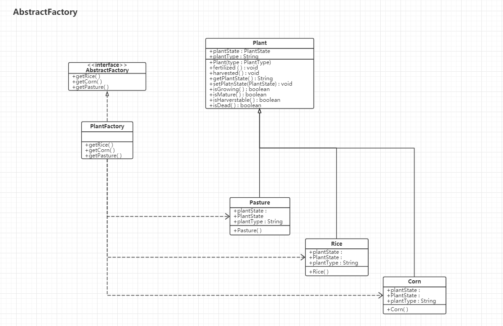

### 3.1.2 Animal 实现API

#### 3.1.2.1 API 描述

​	对于有多种生产物的动物（如Chicken，有外部产品eggs和肉产品chicken），我们提供了chickenFactory等继承自productAbstractFactory的类，抽象工厂的子类重载父类的函数externalPro()和internalPro()，用于获取不同的产品。
​	主要函数如下：

| 函数名             | 作用                                                         |
| ------------------ | ------------------------------------------------------------ |
| void externalPro() | productAbstractFactory的方法，获得动物的额外产品，如动物无额外产品则进行提示 |
| void internalPro() | productAbstractFactory的方法，获得动物的内部产品，即动物的肉 |

#### 3.1.2.2 类图

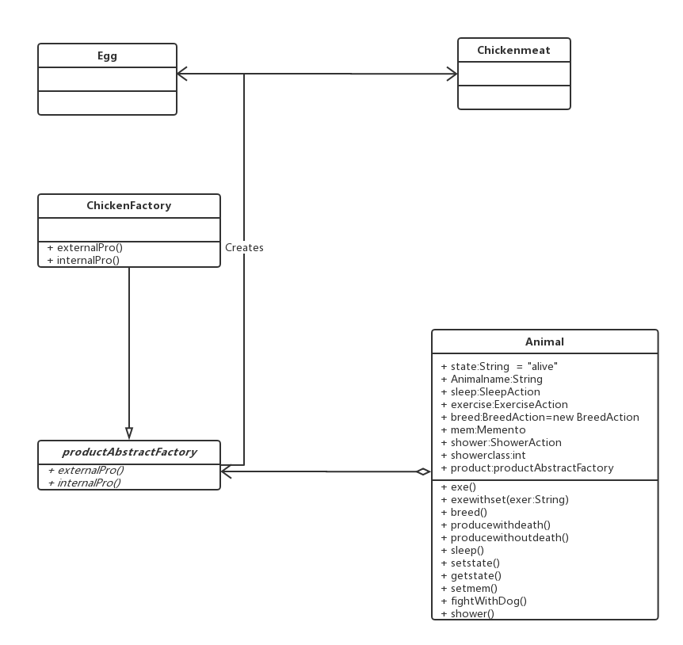

## 3.2 Adapter Pattern

### 设计模式简述

​	在软件开发中采用类似于电源适配器的设计和编码技巧被称为适配器模式。
​	通常情况下，客户端可以通过目标类的接口访问它所提供的服务。有时，现有的类可以满足客户类的功能需要，但是它所提供的接口不一定是客户类所期望的，这可能是因为现有类中方法名与目标类中定义的方法名不一致等原因所导致的。
​	在这种情况下，现有的接口需要转化为客户类期望的接口，这样保证了对现有类的重用。如果不进行这样的转化，客户类就不能利用现有类所提供的功能，适配器模式可以完成这样的转化。
在适配器模式中可以定义一个包装类，包装不兼容接口的对象，这个包装类指的就是适配器(Adapter)，它所包装的对象就是适配者(Adaptee)，即被适配的类。
​	适配器提供客户类需要的接口，适配器的实现就是把客户类的请求转化为对适配者的相应接口的调用。也就是说：当客户类调用适配器的方法时，在适配器类的内部将调用适配者类的方法，而这个过程对客户类是透明的，客户类并不直接访问适配者类。因此，适配器可以使由于接口不兼容而不能交互的类可以一起工作。这就是适配器模式的模式动机。

### 3.2.1 API 描述

对于Petdog类，我们并未将此类继承自Animal类（因为Petdog并非牲畜类动物），因此无法调用Animal的Sleep方法，所以这里提供了一个接口petdogsleep，通过让Petdog作为适配器包装接口petdogsleep提供的函数并继承c1sleep，从而实现对c1sleep睡觉行为类的调用过程。

| 函数名            | 作用                                                         |
| ----------------- | ------------------------------------------------------------ |
| void sleep()      | petdogsleep接口提供的方法，具体的实现在Petdog类中            |
| void sleepstep1() | 父类c1sleep提供的方法，指的是去睡觉的第一步，包装进入sleep函数中 |

### 3.2.2 类图

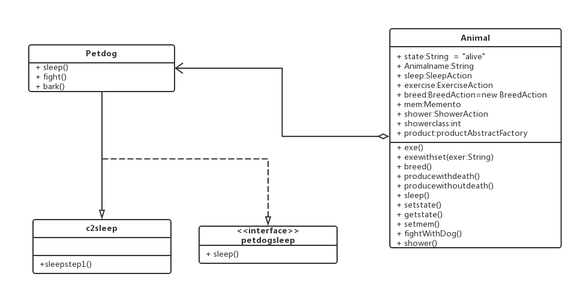

## 3.3 Bridge Pattern

### 设计模式简述

​	桥接模式即将抽象部分与它的实现部分分离开来，使他们都可以独立变化。桥接模式将继承关系转化成关联关系，它降低了类与类之间的耦合度，减少了系统中类的数量，也减少了代码量。

### 3.3.1 API 描述

​	从逻辑上来讲，Chicken，Pig等动物类都有对应的运动类FlyAction和RunAction，但我们并没有直接让每个动物类去聚合并调用具体的运动类，而是让他们的父类Animal对ExerciseAction接口进行调用，然后通过实例化时指定要调用的运动类，从而将Animal和ExerciseAction当做Bridge，减少了耦合度。

| 函数名           | 作用                                                         |
| ---------------- | ------------------------------------------------------------ |
| void exe()       | Animal类执行类内存储的ExerciseAction接口的runaction函数，定义过程在FlyAction,SwimAction和RunAction当中，会随ExerciseAction实例化的类不同而有不同结果，实际含义为动物的简单活动 |
| void runaction() | ExerciseAction继承自Action接口的函数，用以确定Action具体的行为，在ExerciseAction中指的是目标动物执行运动操作 |
| Pig()            | Pig类的构造函数，在实例化过程中，会对父类Animal存储的ExerciseAction类进行实例化，从而确定要调用哪一个ExerciseAction |
| Chicken()        | Chicken类的构造函数，同上                                    |

### 3.3.2 类图

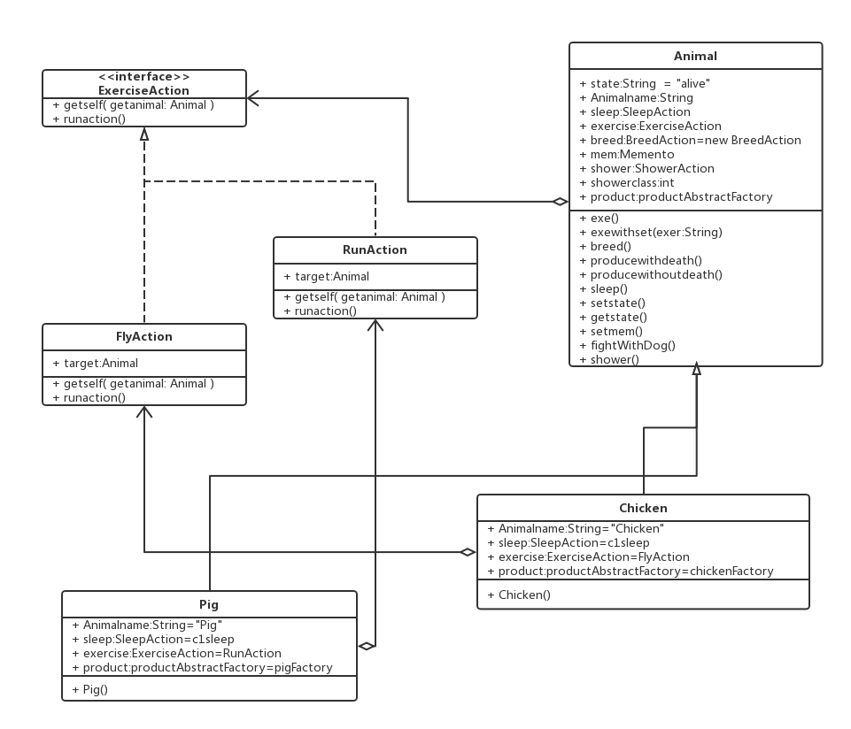

## 3.4 Builder Pattern

### 设计模式简述

​	建造者模式（Builder Pattern）使用多个简单的对象一步一步构建成一个复杂的对象，我们使用这种模式的目的在于将一个复杂的构建与其表示相分离，使得同样的构建过程可以创建不同的表示，这对于设计者来说是一个解耦的过程。其优点在于用户使用简单，并且可以在不需要知道内部构建细节的情况下构建复杂的对象模型，建造者独立而易扩展，便于控制细节风险。缺点在于产品需要有共同点，范围有限制，且如果内部变化复杂，建造类会比较多。

### 3.4.1 API描述

​        在我们的架构中，对设定建造房屋的长度、宽度、高度三种尺寸时使用了Builder设计模式，首先定义设定尺寸的过程（Builder），分别是SetLength()、SetWidth()、SetHeight()三者，都声明为抽象方法，具体由子类进行实现，然后创建具体的建造者（ConcreteBuilder）具体实现三个抽象函数。

### 3.4.2 类图

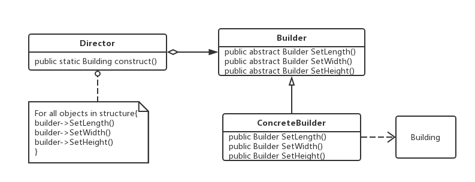

## 3.5 Chain of Responsibilty Pattern

### 设计模式简述

​	在Chain of Responsibilty Pattern中，为请求创建了一个接收者对象的链。这种模式给予请求的类型，对请求的发送者和接收者进行解耦。主要的意图是使多个对象都有机会处理同一个请求，从而避免请求的发送者和接收者之间的耦合关系。将这些对象连成一条链，并沿着这条链传递该请求，直到有一个对象处理它为止。并且对于职责链上的处理者负责处理请求，客户只需要将请求发送到职责链上即可，无须关心请求的处理细节和请求的传递，所以职责链将请求的发送者和请求的处理者解耦。

### 3.5.1 API 描述

​	对于具有多样性的动物的洗澡行为，定义了三个c1shower、c2shower、c3shower继承自ShoweraAction的类，除了父类ShowerAction外，c1shower、c2shower、c3shower分别表示动物在沙中洗澡、在水中洗澡以及不洗澡，每个类中有不同的mode用来与不同的动物洗澡模式showerclass配对。当调用动物的洗澡方法时，会根据ShowerAction、c1shower、c2shower、c3shower的顺序逐个进行比对，直到有匹配的mode时，输出动物的洗澡方法。
​	主要函数如下：

| 函数名                         | 作用                                                         |
| ------------------------------ | ------------------------------------------------------------ |
| void exewithset(String exer)   | Animal的方法，根据输入选择行为模式并执行                     |
| void runaction()               | Action的方法，执行Action对应的操作，在本例中输出动物的洗澡方式 |
| void getself(Animal getanimal) | Action的方法，获得Action的目标对象                           |
| void ShoweraAction()           | ShowerAction的构造函数，初始化mode为0，并设定nextHandler为c1shower的一个实例c1 |
| void c1shower()                | c1shower的构造函数，初始化mode为1，并设定nextHandler为c2shower的一个实例c2 |
| void c2shower()                | c2shower的构造函数，初始化mode为2，并设定nextHandler为c3shower的一个实例c3 |
| void c3shower()                | c3shower的构造函数，初始化mode为3                            |

### 3.5.2 类图

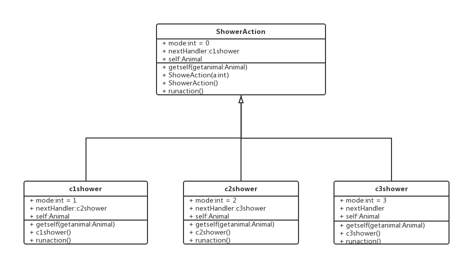

## 3.6 Command Pattern

### 设计模式简述

​	命令模式（Command Pattern）将一个请求封装成一个对象，从而使用不同的请求把客户端参数化，对请求排队或者记录请求日志，可以提供命令的撤销和恢复功能。这是一种数据驱动的设计模式，它属于行为型模式。请求以命令的形式包裹在对象中，并传给调用对象。调用对象寻找可以处理该命令的合适的对象，并把该命令传给相应的对象，该对象执行命令。

​	通过使用此设计模式降低了系统耦合度，容易添加新命令，同时也会使得系统中有过多具体命令类，过于繁杂。

### 3.6.1 API描述

​	在选择养不同的动物时，采用了Command设计模式，在Order类中定义了RaisePig, RaiseSheep, RaiseChicken, RaiseFish四个操作，而这些操作在Order中调用，具体的实现机制被封装好。

|       函数名        |                         作用                          |
| :-----------------: | :---------------------------------------------------: |
|   void execute()    | 执行调用养的行为，通过ChickenList增加相对应的动物数量 |
|   void addOrder()   |                   添加相对应的命令                    |
| void launchOrders() |                     调用命令执行                      |

### 3.6.2 类图

## 3.7 Composite

### 设计模式简述

​	Composite模式属于结构型模式的一种，该模式将对象组合成树形结构，以此来表示对象的“部分-整体”的层次结构。优点是提升了代码的复用性；在逻辑上将树结构中的根节点和叶子节点做同化处理，使高层模块的调用更加简单；经过重写基类Component中的行为函数runAction()，可以使单个对象和复杂对象的使用具有一致性；可以自由的增加节点。但是也会使逻辑会变得更加复杂；叶子节点和根节点都是实现类，而不是接口，违反了依赖倒置原则。

### 3.7.1API描述

​	场景：我们将Composite这一模式使用到了植物授粉这一过程中，定义基类ReproductiveOrgan，子类Flower 和Stamen、Pistil。同时Flower 包含Stamen、Pistil。实现了基本的树状结构。	

### 3.7.2类图

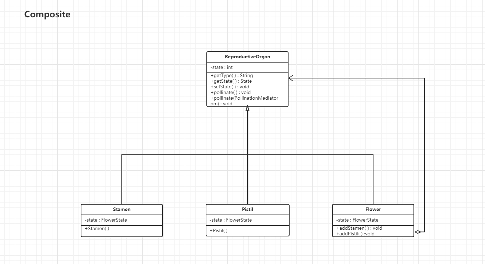

## 3.8 Decorator Pattern

### 设计模式简述

​	装饰器模式（Decorator Pattern）允许向一个现有的对象添加新的功能，同时又不改变其结构。这种类型的设计模式属于结构型模式，它是作为现有的类的一个包装。这种模式创建了一个装饰类，用来包装原有的类，并在保持类方法签名完整性的前提下，提供了额外的功能。

​	装饰器模式相比生成子类更为灵活，能够扩展一个类的功能，并且可以代替继承。

### 3.8.1 API描述

​	我们假设了一种情况，当农场中没有雇员的时候应该怎么办。按照正常情况来说，农场主在这个时候就会做起雇员应该做的事。FarmerDecorator类继承了People类，使得Farmer在没有雇员的情况类通过FarmerDecorator()实现装饰后描述，即可以做雇员应做的事。

|           函数名           |                             作用                             |
| :------------------------: | :----------------------------------------------------------: |
|          Farmer()          |                      Farmer类的构造函数                      |
| void acceptEmployeeVisit() | 查看雇员的数量，以此判断是否调用FarmerDecorator类去装饰Farmer |
|     FarmerDecorator()      | FarmerDecorator类的构造函数，通过装饰使得Farmer可以进行养这个操作 |
|      void raisePig()       | 增加养殖动物，同样的函数还包括raiseFish, raiseSheep, raiseChicken |

### 3.8.2 类图

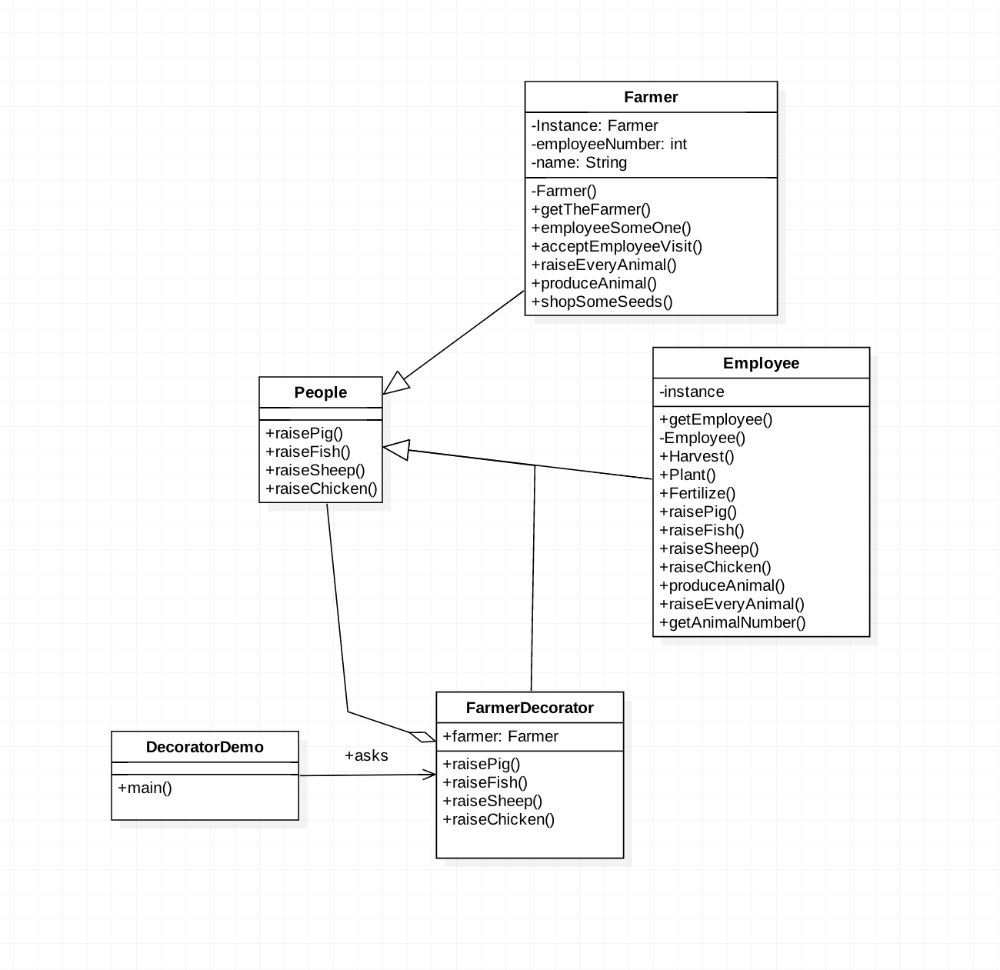

## 3.9 Facade Pattern

​	外观模式（Facade Pattern）隐藏系统的复杂性，并向客户端提供了一个客户端可以访问系统的接口。这种类型的设计模式属于结构型模式，它向现有的系统添加一个接口，来隐藏系统的复杂性。这种模式涉及到一个单一的类，该类提供了客户端请求的简化方法和对现有系统类方法的委托调用。为子系统中的一组接口提供一个一致的界面，外观模式定义了一个高层接口，这个接口使得这一子系统更加容易使用。在层次化结构中，可以使用外观模式定义系统中每一层的入口。

### 3.9.1 Api描述

​	我们为子系统中的一组接口RaiseFish, RaisePig, RaiseChicken, RaiseSheep提供一个一致的界面，Facade模式通过Farmer类进行调用，使得这一子系统更加容易使用。

### 3.9.2 类图

## 3.10 Factory Method Pattern

### 设计模式简述

工厂方法模式（Factory Method）又叫虚拟构造器（Virtual Constructor）模式或者多态工厂模式（Polymorphic Factory），在工厂方法模式中，父类负责定义创建对象的公共接口，而子类则负责生成具体的对象，这样做的目的是将类的实例化操作延迟到子类中完成，即定义了一个用于创建对象的接口，由子类来决定究竟应该实例化哪一个类。其优点在于客户代码可以做到与特定应用无关，适用于任何实体类；能连接并行的类层次结构，具有良好的封装性，代码结构清晰且扩展性好。其缺点在于需要Creator和相应的子类作为Factory Method的载体，如果应用模型不需要Creator和子类存在，则需要增加一个类层次。

### 3.10.1 API描述

​	在我们的架构中，Fertilizer是抽象产品角色，定义产品的接口，而InorganicFertilizer类和OrganicFertilizer类是具体的产品角色，是实现产品接口的具体产品类，抽象工厂角色是FertilizerAbstractFactory类，用来声明工厂方法，返回Fertilizer，而真实的工厂是InorganicFertilizerFactory类和OrganicFertilizerFactory类，实现工厂方法，由客户调用，返回一个实例。

### 3.10.2 类图

## 3.11 Flyweight Pattern

### 设计模式简述

​	享元模式（Flyweight Pattern）是说在有大量对象时，有可能会造成内存溢出，我们把其中共同的部分抽象出来，如果有相同的业务请求，直接返回在内存中已有的对象，避免重新创建。使用这个设计模式时，大大减少了对象的创建，降低系统的内存，使效率提高。但是提高了系统的复杂度，容易造成系统的混乱。

### 3.11.1 API描述

​	通过EmployeeFactory来创建Employee，而Employee类继承自Farmer类。通过这种设计模式运用共享技术有效地支持大量细粒度的对象，避免重新的创建，占用内存。​	

|        函数名         |                            作用                             |
| :-------------------: | :---------------------------------------------------------: |
|    employeeSomeOne    |                    Farmer雇佣雇员的操作                     |
| Emplyee getEmployee() | 通过实现雇佣雇员的操作实现的具体行为，通过类EmployeeFactory |

### 3.11.2 类图

## 3.12 Interpreter Pattern

### 设计模式简述

​	解释器模式（Interpreter Pattern）提供了评估语言的语法或表达式的方式，它属于行为型模式。这种模式实现了一个表达式接口，该接口解释一个特定的上下文。这种模式被用在 SQL 解析、符号处理引擎等。给定一个语言，定义它的文法表示，并定义一个解释器，这个解释器使用该标识来解释语言中的句子。

### 3.12.1 Api描述

​	在这个项目中，有很多重复的加法功能，如果一种特定类型的问题发生的频率足够高，那么可能就值得将该问题的各个实例表述为一个简单语言中的句子。这样就可以构建一个解释器，该解释器通过解释这些句子来解决该问题。

|      函数名      |         作用         |
| :--------------: | :------------------: |
| void interpret() | 实现解释器的具体操作 |

### 3.12.2 类图

​	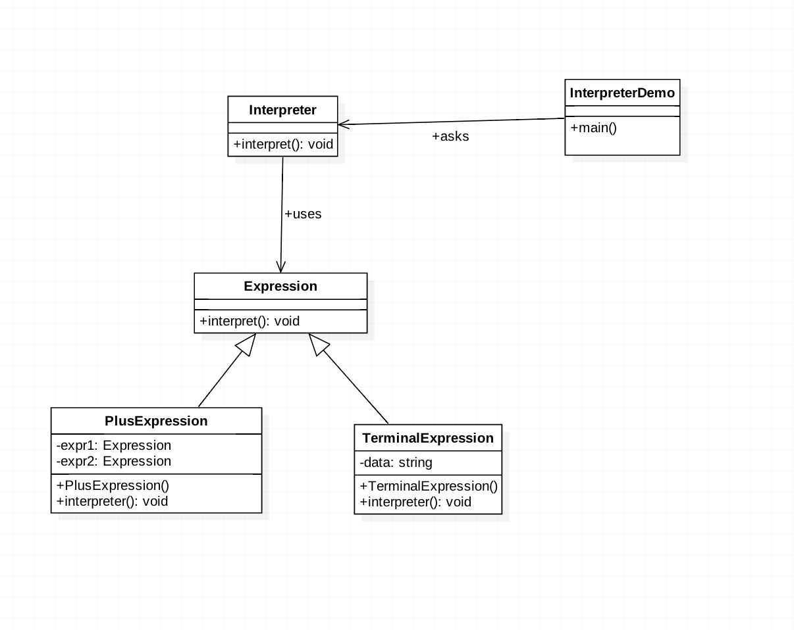

## 3.13 Iterator Pattern

​	迭代器模式（Iterator Pattern）是 Java 和 .Net 编程环境中非常常用的设计模式。这种模式用于顺序访问集合对象的元素，不需要知道集合对象的底层表示。迭代器模式属于行为型模式。提供一种方法顺序访问一个聚合对象中各个元素, 而又无须暴露该对象的内部表示

### 3.13.1 Api 描述

​	在AnimalList类中使用迭代器模式，并且在Employee类中获取迭代器并且使用。

### 3.13.2 类图

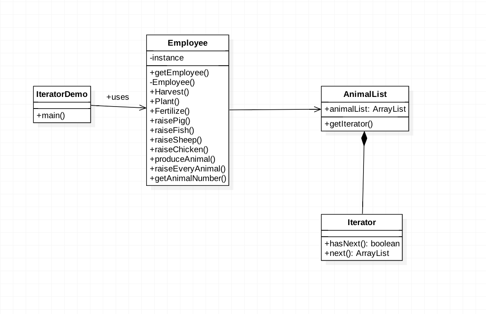

## 3.14Mediator Pattern

​	Mediator解耦多个同事对象之间的复杂交互关系。创建中介者，每个同时对象都用与中介者的交互来替代原本同事对象之间的交互。反过来client则可以通过中介者统一管理所有对象。其优点为解耦多个相似对象之间的复杂交互，从而可以独立的改变他们之间的交互逻辑，从而降低了类结构的复杂度，将多对多模式转化为多对一模式。但是原本的同事对象之间交互越复杂，中介者的逻辑就会越复杂。

### 3.14.1 API描述

​	我们将中介者模式运用到了植物自然传粉这一行为体系中，在自然传粉的过程中，植物群体之间的雌蕊（Pistil类）与雄蕊（Stamen类）将会直接与中介者（PollinationMediator类）进行交互，在逻辑上利用该中介者封装了雄蕊在植物集群中定位某一植株，进而定位某一雌蕊的过程。

### 3.14.2 类图

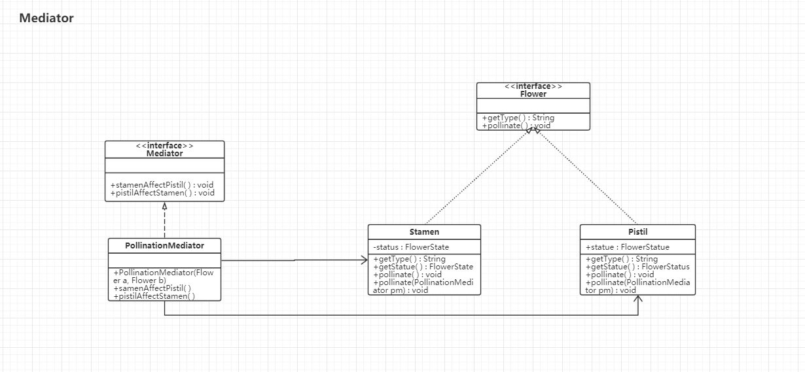

## 3.15 Memento Pattern

### 设计模式简述

​	备忘录模式就是在不破坏封装的前提下，捕获一个对象的内部状态，并在该对象之外保存这个状态，这样可以在以后将对象恢复到原先保存的状态。客户不与备忘录类耦合，与备忘录管理类耦合。

### 3.15.1 API 描述

​	备忘录类就是Memento类，用于存储动物当前的状态，每一个动物的实例都对应一个Memento类，而Animal类就是Memento的管理类，当测试代码客户端对动物进行“复活”操作时，是通过Animal类的接口来对Memento进行操作，访问存储在Memento当中的状态变量并替换掉Animal当中的状态，从而使得Animal复活。

| 函数名                              | 作用                                                         |
| ----------------------------------- | ------------------------------------------------------------ |
| void setmem()                       | 存储状态，Animal类将类内组合的Memento类的状态设为当前Animal的状态 |
| void Animal.getstate()              | 获得状态，输出当前Animal的状态                               |
| void Animal.setstate()              | 设置状态，将当前Animal的状态设置为Memento内存储的状态        |
| void Memento()                      | 备忘录类的构造函数                                           |
| void Memento.getstate()             | 获得状态，返回当前Memento内存储的状态                        |
| void Memento.setstate(String state) | 设置状态，设置当前Memento内存储的状态为传入的状态            |

### 3.15.2 类图

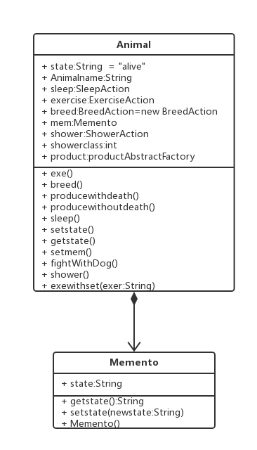

## 3.16 Observer Pattern

​	当对象间存在一对多关系时，则使用观察者模式（Observer Pattern）。比如，当一个对象被修改时，则会自动通知它的依赖对象。观察者模式属于行为型模式。定义对象间的一种一对多的依赖关系，当一个对象的状态发生改变时，所有依赖于它的对象都得到通知并被自动更新。

### 3.16.1 Api 描述

​	当我们要进行收割所有植物的时候，宠物狗是一个观察者，发现此时产生收割所有植物这个动作的时候，这个观察者将会bark。

### 3.16.2 类图

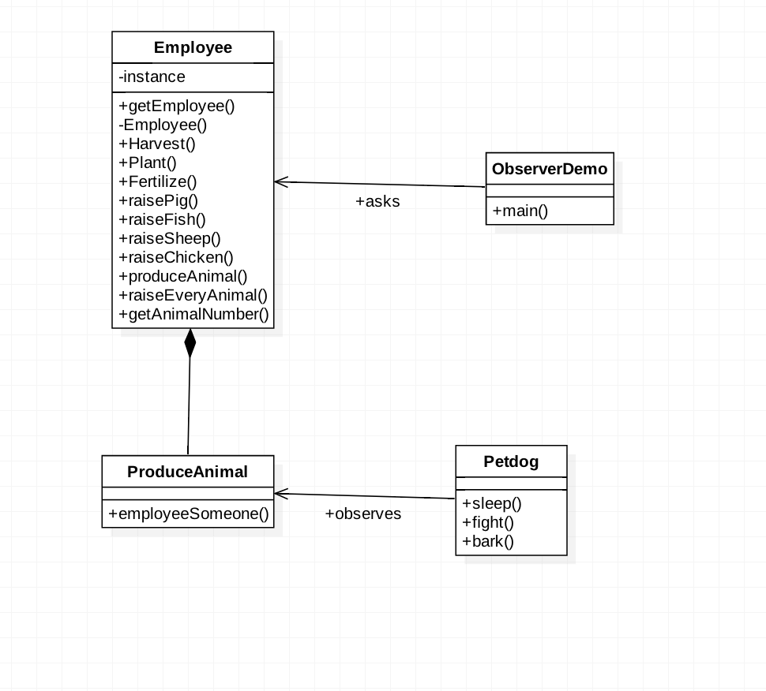

## 3.17 Prototype Pattern

### 设计模式简述

​	原型模式（Prototype Pattern）是用于创建重复的对象，同时又能保证性能。这种类型的设计模式属于创建型模式，它提供了一种创建对象的最佳方式。

​	这种模式是实现了一个原型接口，该接口用于创建当前对象的克隆。当直接创建对象的代价比较大时，则采用这种模式。例如，一个对象需要在一个高代价的数据库操作之后被创建。我们可以缓存该对象，在下一个请求时返回它的克隆，在需要的时候更新数据库，以此来减少数据库调用。模式即将抽象部分与它的实现部分分离开来，使他们都可以独立变化。桥接模式将继承关系转化成关联关系，它降低了类与类之间的耦合度，减少了系统中类的数量，也减少了代码量。

### 3.17.1 Animal实现API

#### 3.17.1.1 API 描述

动物可以进行繁殖操作，这里提供一个方法breed()用于繁殖并产生新的动物类，繁殖操作得到的新的动物类的实例就是一个从旧的Animal类得到的克隆，这样可以避免频繁地调用具体的动物的构造函数。

| 函数名           | 作用                                                         |
| ---------------- | ------------------------------------------------------------ |
| void breed()     | Animal类执行类内存储的BreedAction接口的runaction函数，实际意义是动物的繁殖行为 |
| void runaction() | BreedAction继承自Action接口的函数，用以确定Action具体的行为，在BreedAction中指的是目标动物执行繁殖操作，产生新的动物类并将其添加进入农场，并对新的动物类的各项属性，Animalname,sleep,exercise,shower等都克隆自targetAnimal，即进行繁衍操作的动物类（下图中为鸡） |

#### 3.17.1.2 类图

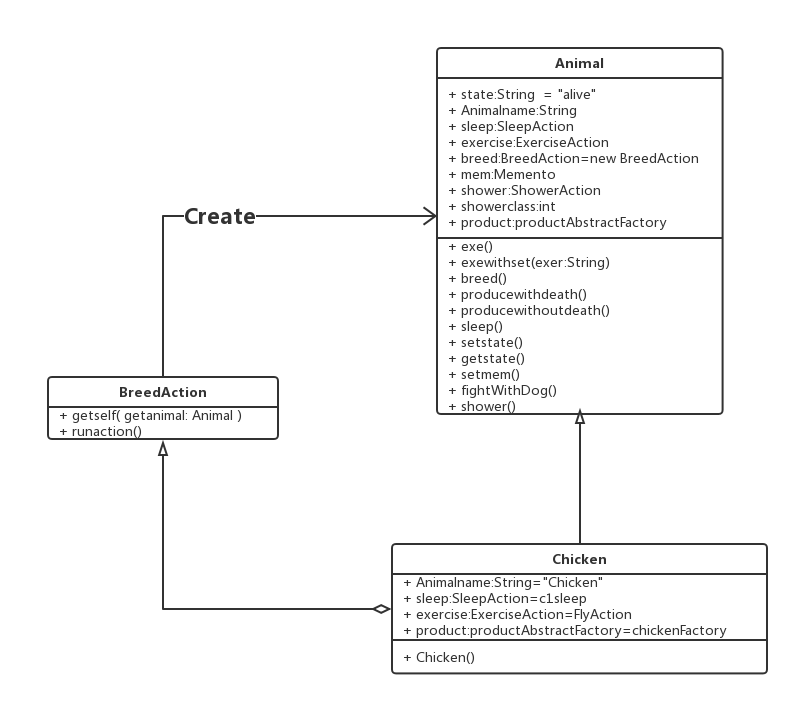

### 3.17.2Item实现API

#### 3.17.2.1 API描述

在建造给人居住的不同价值等级的房屋时，采用了Prototype设计模式，在BuildingForPeople类中声明了addPrototype()，returnType()，findAndClone()，clone()四个函数。addPrototype()用于添加新的Building原型到已有的列队中；returnType()用于得到当前的实例类型；若当前参数不是Building类型，findAndClone()用于克隆一个Building类型实例；clone()只用于克隆一个Building实例。

#### 3.17.2.2 类图

​	

## 3.18 Proxy Pattern

​	代理模式（Proxy Pattern）中，一个类代表另一个类的功能。这种类型的设计模式属于结构型模式。在代理模式中，我们创建具有现有对象的对象，以便向外界提供功能接口。为其他对象提供一种代理以控制对这个对象的访问。

### 3.18.1 Api 描述

​	我们在此时假设一种情况，农场主在又雇员在的时候是不会自己动手工作的，因此农场主需要指派雇员进行工作，所以农场主此时是代理，因此我们想要ProduceAnimal时，我们需要农场主做代理指派雇员进行工作，雇员是这个操作的执行者。

### 3.18.2 类图

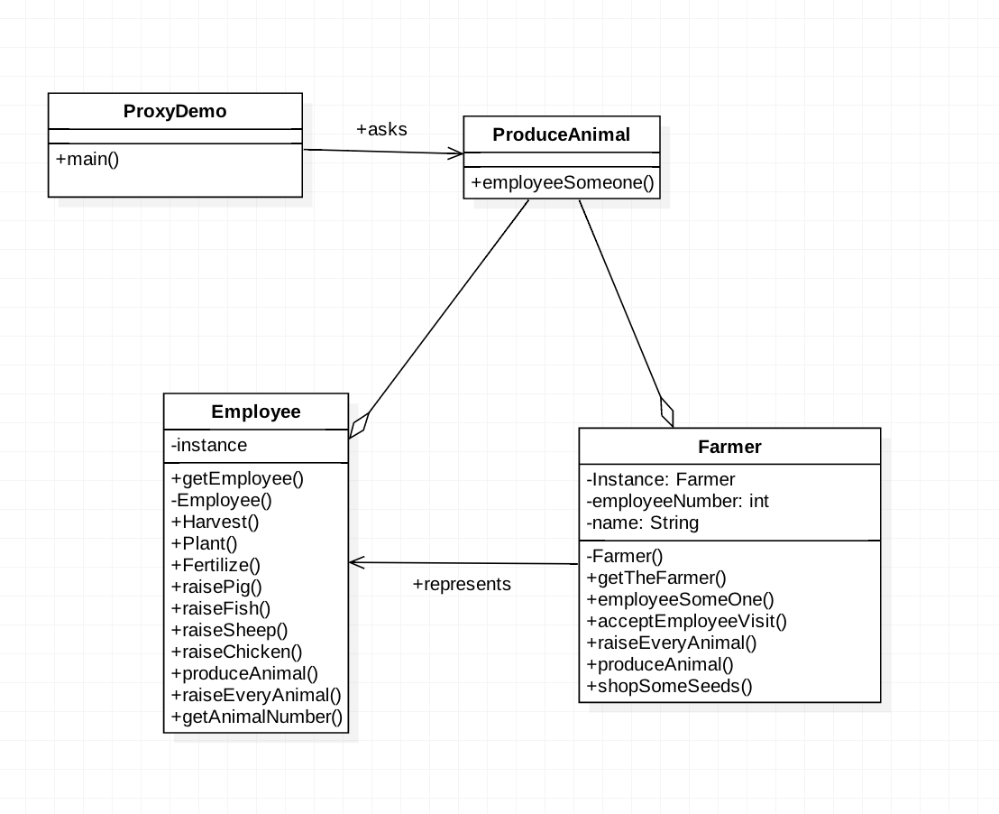

## 3.19 Singleton Pattern

### 设计模式简述

Singleton Pattern涉及到一个单一的类，该类负责创建自己的对象，同时确保只有单个对象被创建。这个类提供了一种访问其唯一的对象的方式，可以直接访问，不需要实例化该类的对象。主要意图是保证一个类仅有一个实例，并提供一个访问它的全局访问点。并且解决一个全局使用的类频繁地创建与销毁的问题。

### 3.19.1 Animal实现API 

#### 3.19.1.1 API描述

实现了一个继承自Animal类的Petdog类，该宠物狗在全局都只有一个，在任何地方都可以调用宠物狗的sleep方法和bark方法。在任何动物处都可以调用fight方法。
​	主要函数如下：

| 函数名       | 作用                                                         |
| ------------ | ------------------------------------------------------------ |
| void sleep() | 全农场唯一的宠物狗睡觉                                       |
| void bark()  | 全农场唯一的宠物狗狂吠                                       |
| void fight() | 在除了宠物狗以外的动物处调用可以和全农场唯一的宠物狗打架，并输出打架结果 |

#### 3.19.1.2 类图

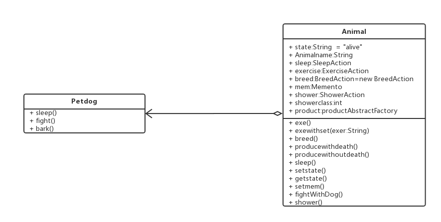

### 3.19.2 Item实现API

#### 3.19.2.1 API描述

定义了FarmAddress(String name)用来获取农场地址这个单例。

#### 3.19.2.2 类图

​	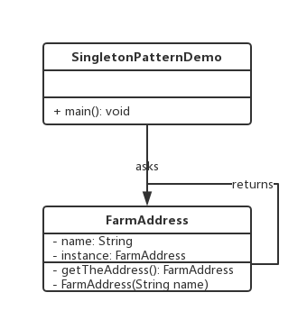

### 3.19.3 Person实现API

#### 3.19.3.1 Api描述

​	我们将Farmer定义为一个单例。

#### 3.19.3.2 类图

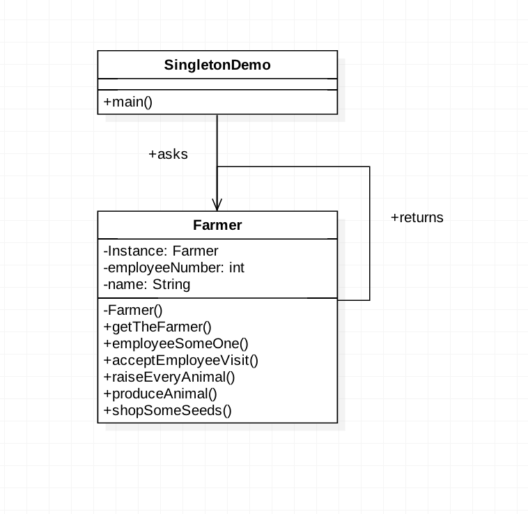

## 3.20 State Pattern

### 设计模式简述

​	State模式允许对象在内部状态发生改变时改变它自身的行为，提供了方便的解决复杂对象状态转换的方法、解决了不同状态下行为的封装问题。优点是在逻辑上确定并枚举可能的状态与该状态下对应的行为方法，将状态与行为做逻辑关联，使得高层模块可以直接通过更改状态实现不同行为的选择；多个环境对象可以共享同一个状态模块，实现了代码的复用。但是在原有的结构基础上增加了不同的状态类与对象类，但在实现方法上得到了精简；对OCP原则不友好，增加新的状态时必不可少的要更改切换状态的源代码。

### 3.20.1 API描述

​	我们以PlantState为基本状态接口，为植物类（Plant）设立了四种成长状态：

| 类名             | 描述       |
| ---------------- | ---------- |
| GrowingState     | 成长阶段   |
| MatureState      | 成熟阶段   |
| HarvestableState | 可收获阶段 |
| DeadState        | 死亡阶段   |

​	四种状态的主要区别在于成长动作moveToNext( ) 方法，同一株植物在不同的成长阶段会有不同的成长方法，如在GrowingState下该方法将会在收到成长命令后输出成长成功的提示，并且重置当前植株的成长状态。

### 3.20.2 类图

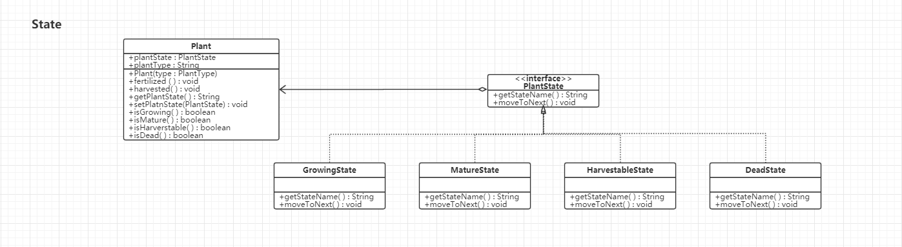

## 3.21 Strategy Pattern

### 设计模式简述

​	Strategy模式定义并封装一系列算法，由具体对象根据场景选择不同的策略，从而调用到对应的不同算法。

​	此设计模式分离具体的算法和客户端，使得客户端可以自由切换算法，算法也可以独立于客户端自由进行更改；避免在同一算法中出现大量的条件判断，而是将原本逻辑复杂的算法拆分成多个结构相对简单的独立算法；算法可扩展性良好。但是在结构框架中需要实例化每一个新的策略类，且需要对外暴露所有的策略，复杂化了结构。

### 3.21.1 Plant 实现API

#### 3.21.1.1 API描述

​	我们为植物提供了多种受粉方式，如自然传粉和人工授粉，分别对应的策略类为SpontaneousPollination和ArtificialPollination。继承自Mediator 的类PollinationMediator将会根据action 的不同，选择不同的策略来为对应植株进行授粉操作。

#### 3.21.1.2 类图

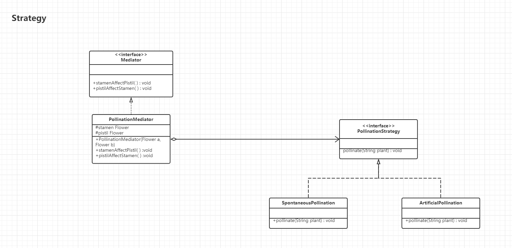

### 3.21.2 Animal 实现API

#### 3.21.2.1 API 描述

​	对于有多种行为模式的动物（如Chicken） 我们提供了包括SwimAction RunAction FlyAction3个实现了ExerciseAction接口的行为类 可以通过exewithSet(String exer)函数动态地进行行为方法选择。
主要函数如下：

| 函数名                         | 作用                                                         |
| ------------------------------ | ------------------------------------------------------------ |
| void exewithset(String exer)   | Animal的方法，根据输入选择行为模式并执行                     |
| void runaction()               | Action的方法，执行Action对应的操作，在具体的SwimAction RunAction FlyAction中进行了实现 |
| void getself(Animal getanimal) | Action的方法，获得Action的目标对象                           |

#### 3.21.2.2 类图

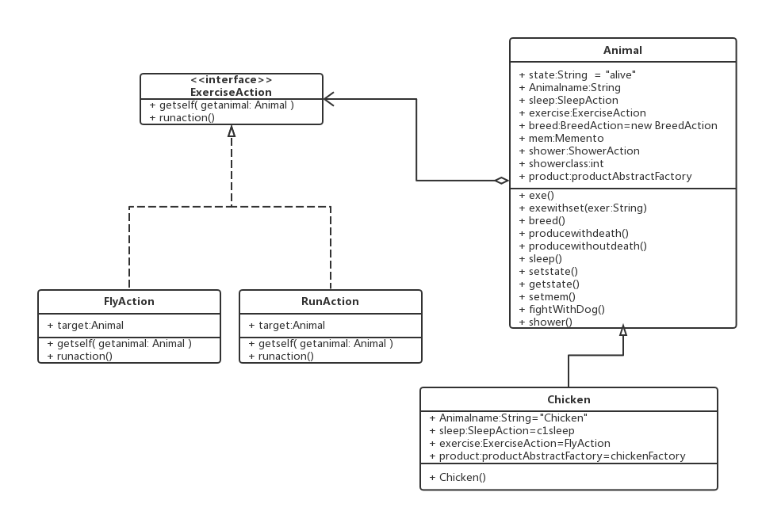

### 3.21.3 Item实现API 

#### 3.21.3.1 API描述

我们通过实现build类，使用不同的建造策略建造不同价值的房子。使用building()接口执行建造的行为，使用setBuildStrat(BuildingType buildingType)设置不同的房屋建造策略，使用doBuilding(BuildingType buildingType)执行建造房屋的行为。

#### 3.21.3.2 类图

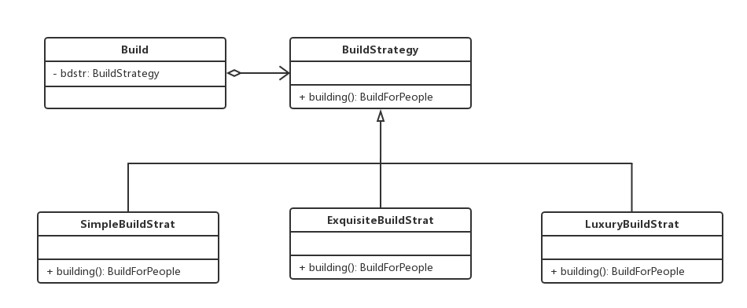

## 3.22 Template Method

### 设计模式简述

​	Template Method提供了一种在父类中定义处理流程，在子类中具体实现的处理方式，同时在具体实现时Template Method又允许子类重新定义流程的具体步骤。优点是实现了反向控制和OCP原则，既提高了代码的复用性，又可以便捷的扩展子类群（扩展性），实现无限的可能性。这个设计模式虽然提高了代码的复用性，但是每一个不同的实现都需要一个新的子类实现，从而提升了系统的复杂度。

### 3.22.1 Plant 实现API

#### 3.22.1.1 API描述

​	场景：我们定义了植物的基类Plant，并在Plant中定义了施肥函数fertilized( )。在基类Plant之下我们又具体实现了Rice、Corn、Pasture三种具体子类，并且为每个子类的fertilized( )函数进行了重写，从而为不同植物子类实现了的不同施肥方式。

#### 3.22.1.2 类图 

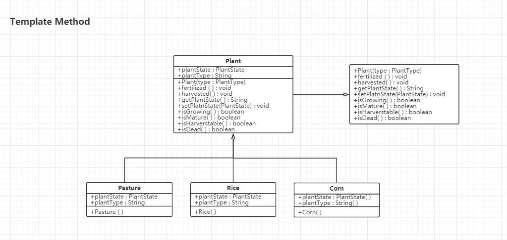

### 3.22.2 Animal 实现API

#### 3.22.2.1 API 描述

​	对于sleepaction，不同的动物有不同的行为，羊，鸡等都要回到各自的房舍中再睡觉，而鱼只需要在池塘中即可，因此睡觉行为是相同的，但去睡觉的行为不同，这里就将sleepaction作为抽象的模板类，然后将c1sleep和c2sleep作为两种方法。

| 函数名            | 作用                                                         |
| ----------------- | ------------------------------------------------------------ |
| void runaction()  | SleepAction实现了接口AnimalAction中提供的方法，实现睡眠过程，执行sleepstep1()和sleepstep2() |
| void sleepstep1() | SleepAction提供的虚函数，去睡觉的行为，在c1sleep和c2sleep中具体定义 |
| void sleepstep2() | SleepAction内定义的函数，睡觉本身的行为                      |

#### 3.22.2.2 类图

### 3.22.3 Item实现API 

#### 3.22.3.1 API描述

​	在我们的架构中，我们创建了抽象模板结构即建房的步骤，即LayFoundation()、ConstructBuilding()、ExteriorTrim()三个函数分别代表夯实地基、建造建筑、外围环境修葺，然后创建具体模板，分别重写ConstructBuilding()和ExteriorTrim()这两个函数，代表着建造House、AnimalFold、PlantField、Storage这四种建筑的三个步骤中后两个都是各自不同的，需要分别实现这两个函数的具体功能。

#### 3.22.3.2 类图

## 3.23 Visitor Pattern

### 设计模式简述

在访问者模式（Visitor Pattern）中，我们使用了一个访问者类，它改变了元素类的执行算法。通过这种方式，元素的执行算法可以随着访问者改变而改变。这种类型的设计模式属于行为型模式。根据模式，元素对象已接受访问者对象，这样访问者对象就可以处理元素对象上的操作。

### 3.23.1 API描述

​	使用实体访问类EmployeeNumberVisitor来执行相应操作。

|           函数名           |                 作用                 |
| :------------------------: | :----------------------------------: |
| void acceptEmployeeVisit() | 在Farmer中去访问此函数得到雇员的数量 |
|        void visit()        |      作为实体类去访问，得到数量      |

### 3.23.2 类图

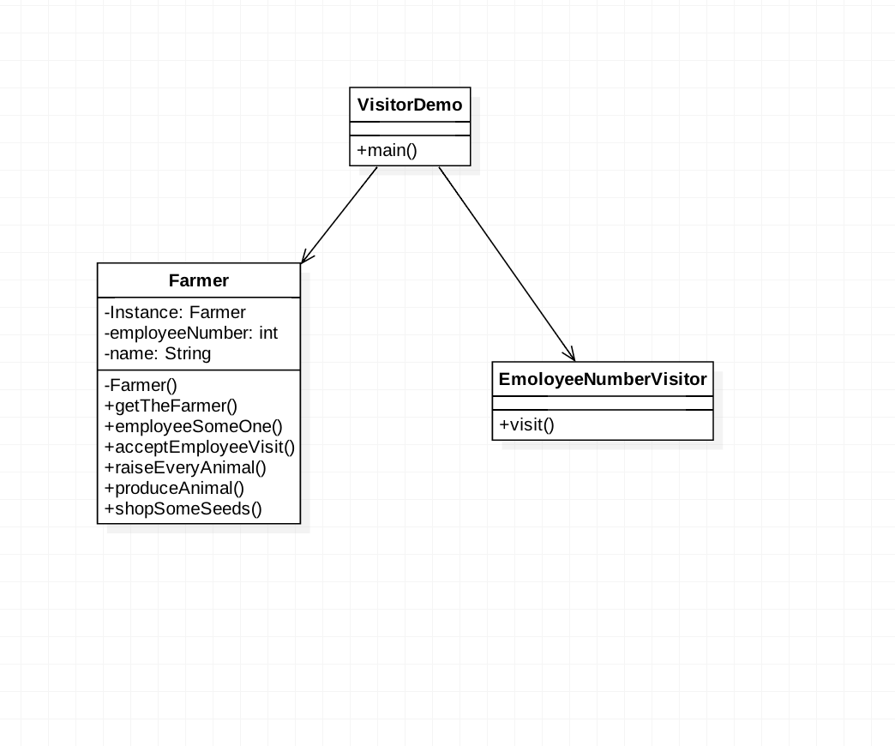