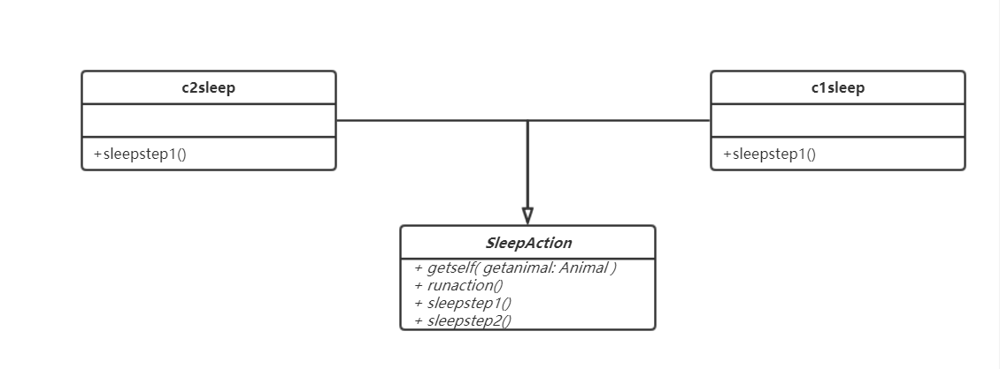

## 3.1 Strategy Pattern
-----------
Strategy是指定义一系列的算法，把他们一个个封装起来，并且使它们可相互替换。Strategy模式使算法可独立于使用它的客户而变化。
应用场景一般是：
- 具有多种可能需要实现的算法
- 需要在程序中对算法进行动态切换
###3.1.1 API 描述
对于有多种行为模式的动物（如Chicken） 我们提供了包括SwimAction RunAction FlyAction3个实现了ExerciseAction接口的行为类 可以通过exewithSet(String exer)函数动态地进行行为方法选择。
主要函数如下：

| 函数名       | 作用  |
| --------   | ----- | 
|  void exewithset(String exer)   | Animal的方法，根据输入选择行为模式并执行    |   
| void runaction() | Action的方法，执行Action对应的操作，在具体的SwimAction RunAction FlyAction中进行了实现     | 
| void getself(Animal getanimal)      | Action的方法，获得Action的目标对象     | 
###3.2.2 类图

## 3.2 Adapter Pattern
-----------
在软件开发中采用类似于电源适配器的设计和编码技巧被称为适配器模式。
通常情况下，客户端可以通过目标类的接口访问它所提供的服务。有时，现有的类可以满足客户类的功能需要，但是它所提供的接口不一定是客户类所期望的，这可能是因为现有类中方法名与目标类中定义的方法名不一致等原因所导致的。
在这种情况下，现有的接口需要转化为客户类期望的接口，这样保证了对现有类的重用。如果不进行这样的转化，客户类就不能利用现有类所提供的功能，适配器模式可以完成这样的转化。
在适配器模式中可以定义一个包装类，包装不兼容接口的对象，这个包装类指的就是适配器(Adapter)，它所包装的对象就是适配者(Adaptee)，即被适配的类。
适配器提供客户类需要的接口，适配器的实现就是把客户类的请求转化为对适配者的相应接口的调用。也就是说：当客户类调用适配器的方法时，在适配器类的内部将调用适配者类的方法，而这个过程对客户类是透明的，客户类并不直接访问适配者类。因此，适配器可以使由于接口不兼容而不能交互的类可以一起工作。这就是适配器模式的模式动机。

####3.2.1 API 描述
对于Petdog类，我们并未将此类继承自Animal类（因为Petdog并非牲畜类动物），因此无法调用Animal的Sleep方法，所以这里提供了一个接口petdogsleep，通过让Petdog作为适配器包装接口petdogsleep提供的函数并继承c1sleep，从而实现对c1sleep睡觉行为类的调用过程。

| 函数名       | 作用  |
| --------   | ----- | 
|  void sleep() | petdogsleep接口提供的方法，具体的实现在Petdog类中    |   
| void sleepstep1()      | 父类c1sleep提供的方法，指的是去睡觉的第一步，包装进入sleep函数中    | 
###3.2.2 类图

## 3.3 Template Pattern
-----------
定义一个模板结构，将具体内容延迟到子类去实现。在不改变模板结构的前提下在子类中重新定义模板中的内容。
该模式的优势在于：提高代码复用性，将相同部分的代码放在抽象的父类中，而将不同的代码放入不同的子类中；实现了反向控制，通过一个父类调用其子类的操作，通过对子类的具体实现扩展不同的行为，实现了反向控制 & 符合“开闭原则”。

####3.3.1 API 描述
对于sleepaction，不同的动物有不同的行为，羊，鸡等都要回到各自的房舍中再睡觉，而鱼只需要在池塘中即可，因此睡觉行为是相同的，但去睡觉的行为不同，这里就将sleepaction作为抽象的模板类，然后将c1sleep和c2sleep作为两种方法

| 函数名       | 作用  |
| --------   | ----- | 
|  void runaction() | SleepAction实现了接口AnimalAction中提供的方法，实现睡眠过程，执行sleepstep1()和sleepstep2()  |   
| void sleepstep1() | SleepAction提供的虚函数，去睡觉的行为，在c1sleep和c2sleep中具体定义    |    
| void sleepstep2() | SleepAction内定义的函数，睡觉本身的行为   |
###3.3.2 类图

## 3.4 Bridge Pattern
-----------
桥接模式即将抽象部分与它的实现部分分离开来，使他们都可以独立变化。桥接模式将继承关系转化成关联关系，它降低了类与类之间的耦合度，减少了系统中类的数量，也减少了代码量。

####3.4.1 API 描述
从逻辑上来讲，Chicken，Pig等动物类都有对应的运动类FlyAction和RunAction，但我们并没有直接让每个动物类去聚合并调用具体的运动类，而是让他们的父类Animal对ExerciseAction接口进行调用，然后通过实例化时指定要调用的运动类，从而将Animal和ExerciseAction当做Bridge，减少了耦合度。

| 函数名       | 作用  |
| --------   | ----- | 
|  void exe() | Animal类执行类内存储的ExerciseAction接口的runaction函数，定义过程在FlyAction,SwimAction和RunAction当中，会随ExerciseAction实例化的类不同而有不同结果，实际含义为动物的简单活动  |   
| void runaction() | ExerciseAction继承自Action接口的函数，用以确定Action具体的行为，在ExerciseAction中指的是目标动物执行运动操作  |    
| Pig() | Pig类的构造函数，在实例化过程中，会对父类Animal存储的ExerciseAction类进行实例化，从而确定要调用哪一个ExerciseAction  | 
| Chicken() | Chicken类的构造函数，同上 | 
###3.4.2 类图

## 3.5 Prototype Pattern
-----------
原型模式（Prototype Pattern）是用于创建重复的对象，同时又能保证性能。这种类型的设计模式属于创建型模式，它提供了一种创建对象的最佳方式。

这种模式是实现了一个原型接口，该接口用于创建当前对象的克隆。当直接创建对象的代价比较大时，则采用这种模式。例如，一个对象需要在一个高代价的数据库操作之后被创建。我们可以缓存该对象，在下一个请求时返回它的克隆，在需要的时候更新数据库，以此来减少数据库调用。模式即将抽象部分与它的实现部分分离开来，使他们都可以独立变化。桥接模式将继承关系转化成关联关系，它降低了类与类之间的耦合度，减少了系统中类的数量，也减少了代码量。

####3.5.1 API 描述
动物可以进行繁殖操作，这里提供一个方法breed()用于繁殖并产生新的动物类，繁殖操作得到的新的动物类的实例就是一个从旧的Animal类得到的克隆，这样可以避免频繁地调用具体的动物的构造函数。

| 函数名       | 作用  |
| --------   | ----- | 
|  void breed() | Animal类执行类内存储的BreedAction接口的runaction函数，实际意义是动物的繁殖行为  |   
| void runaction() | BreedAction继承自Action接口的函数，用以确定Action具体的行为，在BreedAction中指的是目标动物执行繁殖操作，产生新的动物类并将其添加进入农场，并对新的动物类的各项属性，Animalname,sleep,exercise,shower等都克隆自targetAnimal，即进行繁衍操作的动物类（下图中为鸡） |    

###3.5.2 类图

## 3.6 Memento Pattern
-----------
备忘录模式就是在不破坏封装的前提下，捕获一个对象的内部状态，并在该对象之外保存这个状态，这样可以在以后将对象恢复到原先保存的状态。客户不与备忘录类耦合，与备忘录管理类耦合。

####3.6.1 API 描述
备忘录类就是Memento类，用于存储动物当前的状态，每一个动物的实例都对应一个Memento类，
而Animal类就是Memento的管理类，当测试代码客户端对动物进行“复活”操作时，是通过Animal类的接口来对Memento进行操作，访问存储在Memento当中的状态变量并替换掉Animal当中的状态，从而使得Animal复活。

| 函数名       | 作用  |
| --------   | ----- | 
|  void setmem() | 存储状态，Animal类将类内组合的Memento类的状态设为当前Animal的状态  |   
| void Animal.getstate() | 获得状态，输出当前Animal的状态|    
| void Animal.setstate() | 设置状态，将当前Animal的状态设置为Memento内存储的状态| 
| void Memento() | 备忘录类的构造函数| 
| void Memento.getstate() | 获得状态，返回当前Memento内存储的状态|    
| void Memento.setstate(String state) | 设置状态，设置当前Memento内存储的状态为传入的状态|   

###3.6.2 类图

## 3.7 Abstract Factory Pattern
-----------
在Abstract Factory Pattern中，接口是负责创建一个相关对象的工厂，不需要显式指定它们的类。每个生成的工厂都能按照工厂模式提供对象。 
- 意图：提供一个创建一系列相关或相互依赖对象的接口，而无需指定它们具体的类。
- 主要解决接口选择的问题。

### 3.7.1 API 描述
对于有多种生产物的动物（如Chicken，有外部产品eggs和肉产品chicken），我们提供了chickenFactory等继承自productAbstractFactory的类，抽象工厂的子类重载父类的函数externalPro()和internalPro()，用于获取不同的产品。
主要函数如下：

| 函数名       | 作用  |
| --------   | ----- | 
| void externalPro()   | productAbstractFactory的方法，获得动物的额外产品，如动物无额外产品则进行提示 |
| void internalPro()   | productAbstractFactory的方法，获得动物的内部产品，即动物的肉 |
### 3.7.2 类图

## 3.8 Singleton Pattern
-----------
Singleton Pattern涉及到一个单一的类，该类负责创建自己的对象，同时确保只有单个对象被创建。这个类提供了一种访问其唯一的对象的方式，可以直接访问，不需要实例化该类的对象。
- 意图：保证一个类仅有一个实例，并提供一个访问它的全局访问点。
- 主要解决：一个全局使用的类频繁地创建与销毁。
### 3.8.1 API 描述
实现了一个继承自Animal类的Petdog类，该宠物狗在全局都只有一个，在任何地方都可以调用宠物狗的sleep方法和bark方法。在任何动物处都可以调用fight方法。
主要函数如下：

| 函数名       | 作用  |
| --------   | ----- | 
| void sleep()  | 全农场唯一的宠物狗睡觉 |
| void bark()   | 全农场唯一的宠物狗狂吠 |
| void fight()  | 在除了宠物狗以外的动物处调用可以和全农场唯一的宠物狗打架，并输出打架结果 |
### 3.8.2 类图

## 3.9 Chain of Responsibilty Pattern
-----------
在Chain of Responsibilty Pattern中，为请求创建了一个接收者对象的链。这种模式给予请求的类型，对请求的发送者和接收者进行解耦。

- 意图：使多个对象都有机会处理同一个请求，从而避免请求的发送者和接收者之间的耦合关系。将这些对象连成一条链，并沿着这条链传递该请求，直到有一个对象处理它为止。

- 主要解决：职责链上的处理者负责处理请求，客户只需要将请求发送到职责链上即可，无须关心请求的处理细节和请求的传递，所以职责链将请求的发送者和请求的处理者解耦了。
### 3.9.1 API 描述
对于具有多样性的动物的洗澡行为，定义了三个c1shower、c2shower、c3shower继承自ShoweraAction的类，除了父类ShowerAction外，c1shower、c2shower、c3shower分别表示动物在沙中洗澡、在水中洗澡以及不洗澡，每个类中有不同的mode用来与不同的动物洗澡模式showerclass配对。当调用动物的洗澡方法时，会根据ShowerAction、c1shower、c2shower、c3shower的顺序逐个进行比对，直到有匹配的mode时，输出动物的洗澡方法。
主要函数如下：

| 函数名       | 作用  |
| --------   | ----- | 
|  void exewithset(String exer)   | Animal的方法，根据输入选择行为模式并执行    |   
| void runaction()      | Action的方法，执行Action对应的操作，在本例中输出动物的洗澡方式     | 
| void getself(Animal getanimal)      | Action的方法，获得Action的目标对象     | 
| void ShoweraAction()      | ShowerAction的构造函数，初始化mode为0，并设定nextHandler为c1shower的一个实例c1  | 
| void c1shower()      | c1shower的构造函数，初始化mode为1，并设定nextHandler为c2shower的一个实例c2     | 
| void c2shower()       | c2shower的构造函数，初始化mode为2，并设定nextHandler为c3shower的一个实例c3       | 
| void c3shower()       | c3shower的构造函数，初始化mode为3     | 

### 3.9.2 类图

